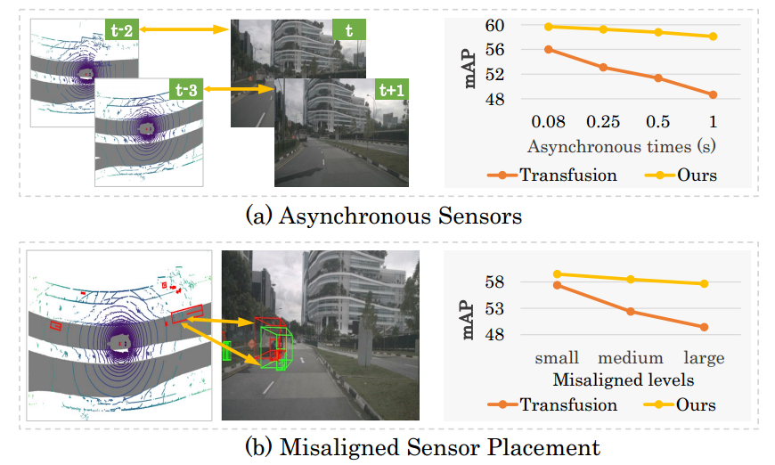
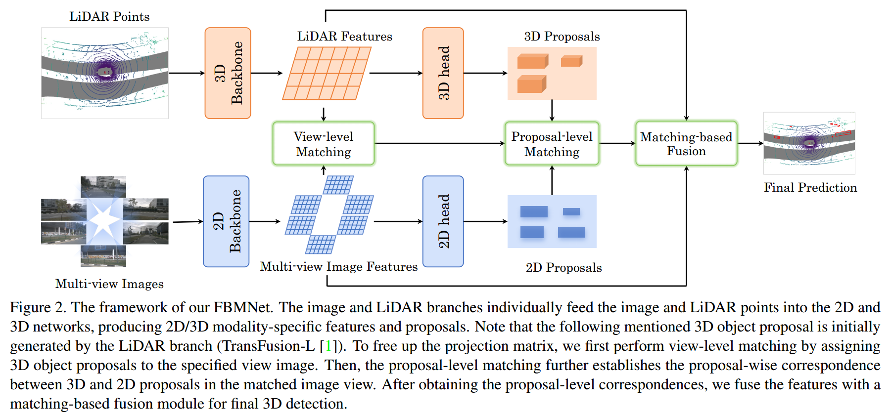
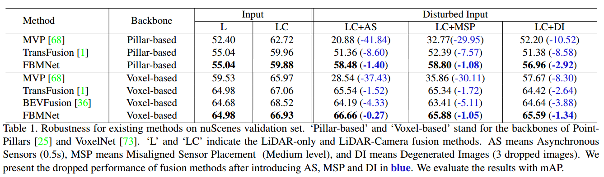

# Multi-Modal 3D Object Detection by Box Matching (FBMNet)

## Highlights

FBMNet frees up the heavy dependency of a projection matrix adopted for most existing multi-modal 3D detection methods by **box matching strategy**. Most importantly, FBMNet possesses superior robustness for the following cases:

**1) Temporal Asynchronous between LiDAR and Camera sensors;**

**2) Spatial  Misalignment including inaccurate calibration or misaligned sensor placement when deployment; **

**3)  Degenerated Images including dropped images or heavily disturbed images;**

## Introduction

Multi-modal 3D object detection has received growing attention as the information from different sensors like LiDAR and cameras are complementary. Most fusion methods for 3D detection rely on an accurate alignment and calibration between 3D point clouds and RGB images. However, such an assumption is not reliable in a real-world self-driving system, as the alignment between different modalities is easily affected by asynchronous sensors and disturbed sensor placement. We propose a novel {F}usion network by {B}ox {M}atching (FBMNet) for multi-modal 3D detection, which provides an alternative way for cross-modal feature alignment by learning the correspondence at the bounding box level to free up the dependency of calibration during inference. With the learned assignments between 3D and 2D object proposals, the fusion for detection can be effectively performed by combing their ROI features. Extensive experiments on the nuScenes dataset demonstrate that our method is much more  stable in dealing with challenging cases such as asynchronous sensors,  misaligned sensor placement, and degenerated camera images than existing fusion methods. We hope that our FBMNet could provide an available solution to dealing with these challenging cases for safety in real autonomous driving scenarios.

## Main Results

For more experiments, please refer to our paper.

## Acknowledgement

We sincerely thank the authors of [mmdetection3d](https://github.com/open-mmlab/mmdetection3d), [CenterPoint](https://github.com/tianweiy/CenterPoint), [TransFusion](https://github.com/XuyangBai/TransFusion), [MVP](https://github.com/tianweiy/MVP), [BEVFusion](https://github.com/ADLab-AutoDrive/BEVFusion) and [BEVFusion](https://github.com/mit-han-lab/bevfusion). 

